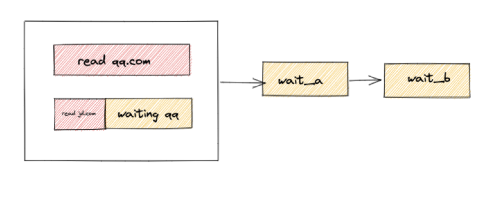
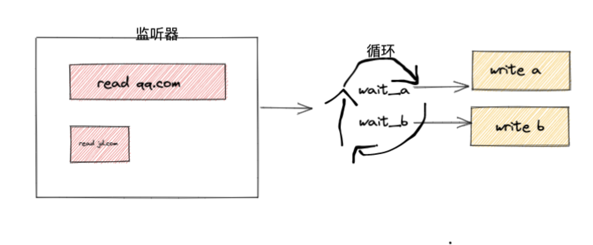
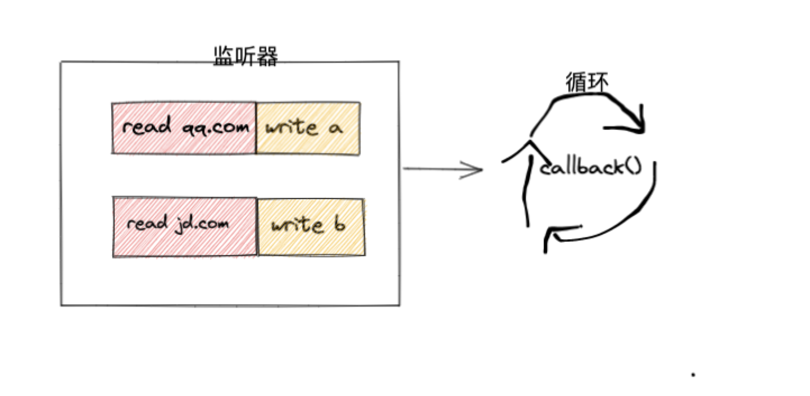

# 异步编程

本文章主要参考 [从根本上了解异步编程体系](https://mp.weixin.qq.com/s/q6BfOINeqgm5nffrHu4kQA)，然后做一些总结。

整篇文章会采用图示的形式来帮助大家更好的理解，所有内容都是来自[上述](https://mp.weixin.qq.com/s/q6BfOINeqgm5nffrHu4kQA)的文章。

比如此时有一个简单的同步代码是读取磁盘中`number.txt`的值，在获得值后进行 number + 1 的操作。

```tsx
let number = read('number.txt')
print(number + 1)
```

总的耗时是不会因为采用同步还是异步就会发生变化，因此

> 单个异步任务绝不会比同步任务执行得更快

假设操作系统提供了 `read_async` 函数，不妨把之前的同步改成异步的形式：

```tsx
let operation = read_async("number.txt");
let number = 0;
while true {
  if operation.is_finish() {
    number = operation.get_content();
    break;
  }
}
print(number+1);
```

这样的代码看起来更加的糟糕，执行 `print(number+1)` 也必须等 while 循环结束。反而增加了额外的代码。那么异步的价值到底在哪里呢？

接着上面的例子，修改下代码：

```tsx
let a = read('qq.com')
let b = read('jd.com')
print(a + b)
```


假设单个网络请求耗时 50ms，忽略 print 的耗时，那么上面这段代码总耗时是 100ms

修改为异步代码：

```tsx
let op_a = read_async("qq.com");
let op_b = read_async("jd.com");
let a = “”;
let b = “”;
while true {
  if op_a.is_finish() {
    a = op_a.get_content();
    break;
  }
}
while true {
  if op_b.is_finish() {
    b = op_b.get_content();
    break;
  }
}
print(a+b);
```


异步读取，程序立即返回了，但是至少也要等待 50ms 以后才会有结果，因为是异步的所以在读取 `qq.com` 的同时也在读取 `jd.com`，那么在 a 完成后，执行到 b 代码的循环，很可能 b 也读取完成了。那么相比于上面的同步代码节约了整整一半的时间。

> 异步并不会让逻辑上串行的任务变快，只能让逻辑上可以并行的任务执行更快

**虽然以上异步代码执行速度更快了，但是它也付出了额外的代价。同步代码虽然执行耗时 100ms，但是 CPU 可以认为一直处于“休眠状态”；而以上异步代码中，CPU 却一直在不断地询问操作是否完成。速度更快，但更费电了！！**

## 结合同步的优势

在上面的同步代码中，执行一个同步调用，操作系统会把当前线程挂起，等调用成功后再唤醒线程继续执行，这个过程中 CPU 可以去执行别的线程的任务，而不会空转。如果没有别的任务，甚至可以处于半休眠状态。这说明了一个关键问题，即操作系统是完全知道一个磁盘读取或者网络调用什么时候完成的，只有这样它才能在正确的时间唤醒对应线程（操作系统在这里用到的技术就是中断，这不在本文的范围内就不多讨论了）。既然操作系统有这个能力，那么假如操作系统提供这样一个函数：

```ts
fn wait_until_get_ready(Operation) -> Response {
  // 阻塞任务，挂起线程，直到operation就绪再唤起线程
}
```

修改异步代码

```ts
let op_a = read_async('qq.com')
let op_b = read_async('jd.com')
let a = wait_until_get_ready(op_a)
let b = wait_until_get_ready(op_b)
print(a + b)
```


当调用 `wait_until_get_ready(op_a)` 时，op_a 还没有就绪，操作系统就挂起当前线程，直到 50ms 以后 op_a 就绪。这个过程就像执行同步阻塞代码一样不耗费 CPU 资源。然后继续执行 `wait_until_get_ready(op_b)`，发现 op_b 也就绪了。这样，我们就可以利用异步代码，只花费 50ms，并且不花费额外的 CPU 资源，就能完成这个任务，完美！

我们的异步代码能够做到这点，主要依赖两个关键因素:

- `read_async` 把任务交给操作系统后能够立刻返回，而不会一直阻塞到它执行完毕。通过这个能力，我们可以让逻辑上没有依赖的任务并发执行
- `wait_until_get_ready` 依赖于操作系统的通知能力，不用自己去轮询，大大节约了 CPU 资源

`read_async` 和 `wait_until_get_ready` 是伪代码函数，而要实现它们离不开操作系统的底层支撑

## 异步编程范式 - 从 0 开始进化成 JavaScript

对前面的例子稍作修改：

```ts
let op_a = read_async('qq.com')
let op_b = read_async('jd.com')
let a = wait_until_get_ready(op_a)
write_to('qq.html', a)
let b = wait_until_get_ready(op_b)
write_to('jd.html', b)
```



之前假设每个异步请求耗时都是 50ms, 但是绝大多数的时候我们是无法做出这样的假设的，因为网络是不稳定的。当我们并发的发出两个请求后，并不知道哪个请求会先响应。假设 qq.com 的响应市场为 50ms, jd.com 的响应市场为 10ms, 那么上面的程序会有什么问题？

如果我们先 `wait_until_get_ready(op_a)`，那么线程就会被阻塞直到 `op_a` 就绪，也就是 50ms，但实际上 `op_b` 只需要 10ms 就已经就绪，但是我们的程序并没有及时去处理。这里的根本原因是我们写代码的时候并不知道每个异步请求会在什么时刻完成，只能按照特定的顺序，这样就会造成效率低下。怎么办？

这里的问题就出在 `wait_until_get_ready` 只支持 wait 一个异步操作，不好用。系统需要支持这样的两个函数：

```ts
fn add_to_wait_list(operations: Vec<Operation>)
fn wait_until_some_of_them_get_ready() ->Vec<Operation>
```

通过 `add_to_wait_list` 向全局的监听器注册需要监听的异步操作，然后利用 `wait_until_some_of_them_get_ready`，如果没有事件就绪就阻塞等待，当注册的异步操作有就绪的了（可能有多个），就唤醒线程并返回一个数组告诉调用方哪些操作就绪了。如果监听队列为空时，`wait_until_some_of_them_get_ready` 不会阻塞而直接返回一个空数组。

```ts
let op_a = read_async("qq.com");
let op_b = read_async("jd.com");
add_to_wait_list([op_a, op_b]);
while true {
  let list = wait_until_some_of_them_get_ready();
  if list.is_empty() {
    break;
  }
  for op in list {
    if op.equal(op_a) {
      write_to("qq.html", op.get_content());
    } else if op.equal(op_b) {
      write_to("jd.html", op.get_content());
    }
  }
}
```



通过这种方式，我们的程序能够及时地响应异步操作，避免盲目地等待，收到一个响应就能立刻输出一个文件。

但是目前这样的实现有两个问题：

第一是由于异步操作的耗时不同，每次 `wait_until_some_of_them_get_ready` 返回的可能是一个就绪的异步操作，也可能是多个，因此我们必须要通过一个 while 循环不断去 wait，直到队列所有异步操作都就绪为止。

第二个问题是，由于返回了一个就绪的异步操作的列表，**每个异步操作后续的逻辑可能都不一样**，我们必须要先判断是什么事件就绪才能执行对应的逻辑，因此不得不做一个很复杂的循环比较。

其实有个很简单的解决办法：由于 operation 和其就绪后要执行的逻辑是一一对应的，因此我们可以直接把对应的后续执行函数绑定到 operation 上比如:

```ts
function read_async_v1(targetURL: String, callback: Function) {
  let operation = read_async('qq.com')
  operation.callback = callback
  return operation
}
```

这样我们可以在创建异步任务时就绑定上它后续的逻辑，也就是所谓的回调函数。然后我们 while 循环内部就彻底清爽了，而且避免了一次 O(n)的循环匹配。这是不是就是 C++所谓的动态派发

```ts
let op_a = read_async_v1("qq.com", function(data) {
  send_to("pony@qq.com", data);
});
let op_b = read_async_v1("jd.com", function(data) {
  write_to("jd.html", data);
});
add_to_wait_list([op_a, op_b]);
while true {
  let list = wait_until_some_of_them_get_ready();
  if list.is_empty() {
    break;
  }
  for op in list {
    op.callback(op.get_content());
  }
}
```



read_async 返回的 operation 对象需要能够支持绑定回调函数。

我们还可以再更进一步，让 `read_async_v1` 自己去注册监听器：

```ts
function read_async_v2(target, callback) {
  let operation = read_async(target)
  operation.callback = callback
  add_to_wait_list([operation])
}
```

这样我们的代码可以更简化：

```ts
read_async_v2("qq.com", function(data) {
  send_to("mahuateng@qq.com", data);
});
read_async_v2("jd.com", function(data) {
  write_to("jd.html", data);
});
while true {
  let list = wait_until_some_of_them_get_ready();
  if list.is_empty() {
    break;
  }
  for op in list {
    op.callback(op.get_content());
  }
}
```

由于我们把后续逻辑都绑定到 operation 上了，每个异步程序都需要在最后执行上述的 while 循环来等待异步事件就绪，然后执行其回调。因此如果我们有机会设计一门编程语言，那就可以把这段代码放到语言的运行时里，让用户不需要每次都在最后加这么一段。经过这个改造后，我们的代码就变成了：

```ts
read_async_v2('qq.com', function (data) {
  send_to('pony@qq.com', data)
})
read_async_v2('jd.com', function (data) {
  write_to('jd.html', data)
})

// 编译器帮我们把while循环自动插到这里
// 或者什么异步框架帮我们做while循环
```

你看，这是不是就是 javascript 了！！js 的 v8 引擎帮我们执行了 while 循环，也就是 JS 里大家常说的 EventLoop。

再简单回顾一下：

- 为了让程序在同一时间内处理更多的请求，我们采用多线程。多线程虽然编写简单，但是对内存和 CPU 资源消耗大，因此我们考虑利用系统的异步接口进行开发;
- 我不知道异步操作什么时候结束，只能不停的轮询它的状态。当有多个异步操作，每个的响应时间都未知，不知道该去先轮询哪个。我们利用操作系统提供的能力，把异步事件加入全局监听队列，然后通过 wait_until_some_of_them_get_ready 来等待任意事件就绪，所谓的 EventLoop；
- 当事件就绪后 EventLoop 不知道该执行什么逻辑，只能进行一个非常复杂的判断才能确认后续逻辑该执行哪个函数。因此我们给每个异步事件注册回调函数，这样 EventLoop 的实现就高效而清爽了;
- 所有异步程序都需要在最后执行 EventLoop 等待事件就绪然后执行回调，因此可以把 EventLoop 这块逻辑放到语言自身的 runtime 中，不需要每次自己写。

我们上述利用到的 `wait_until_some_of_them_get_ready` 对应到真实的操作系统上，其实就是 Linux 的 epoll，Mac 的 kqueue 以及 windows 的 iocp。其实不止 javascript，C 和 C++很多异步框架也是类似的思路，比如著名的 Redis 使用的 libevent，以及 nodejs 使用的 libuv。这些框架的共同特点就是，它们提供了多种异步的 IO 接口，支持事件注册以及通过回调来进行异步编程。只是像 C 代码，由于不支持闭包，基于它们实现的异步程序，实际上比 js 开发的更难以阅读和调试。

你是不是觉得 js 的异步回调对于编写异步代码已经是一个相当高级的编程方式了。不过接下来才是真正的魔鬼！

## 回调地狱

臭名昭著的回调地狱。比如：

```ts
login(user => {
  getStatus(status => {
    getOrder(order => {
      getPayment(payment => {
        getRecommendAdvertisements(ads => {
          setTimeout(() => {
            alert(ads)
          }, 1000)
        })
      })
    })
  })
})
```


由于每次异步操作都需要有一个回调函数来执行就绪后的后续逻辑，因此当遇上各个异步操作之前有先后关系时，势必就要回调套回调。当业务代码一复杂，回调套回调写多了，造成代码难以阅读和调试，就成了所谓的**回调地狱**。

JS 圈的大佬们花了很多精力来思考如何解决回调地狱的问题，其中最著名的就是 **promise**。promise 并不是什么可以把同步代码变异步代码的黑魔法。它只是一种编程手法，或者你可以理解为一种封装，并没有借助操作系统额外的能力。这也是为什么我的标题是“编程范式”，**promise 就是一种范式**。

想想出现这种层层嵌套的本质是什么。说到底，其实就是我们通过回调这种方式来描述“当一个异步操作完成之后接下来该干什么”。多个异步操作有先后关系，因此自然而然形成了回调地狱。既然多个异步操作组成了“串行”逻辑，那么我们能用更“串行”的方式来描述这个逻辑吗？比如：

```ts
login(username, password)
  .then(user => getStatus(user.id))
  .then(status => getOrder(status.id))
  .then(order => getPayment(order.id))
  .then(payment => getRecommendAdvertisements(payment.total_amount))
  .then(ads => {
    /*...*/
  })
```

这样看起来就比层层嵌套的回调直观一些了，先执行 A 操作，then 执行 B，then 执行 C……逻辑的先后关系一目了然，书写方式也符合我们人类串行的思维方式。但是这种编程方式怎么实现呢？

回想之前我们实现异步回调时，异步函数会返回一个 operation 对象，这个对象保存了回调函数的函数指针，因此当 EventLoop 发现该 operation 就绪后就可以直接跳转到对应的回调函数去执行。但是在上述链式调用.then 的代码中，我们调用 `login(username, pwd).then(...)` 时，注意是当 login 这个函数已经执行完毕了，才调用的 then。相当于我已经把异步函数提交执行了之后，才来绑定的回调函数。这个能实现吗？

回顾下 `read_async_v2`:

```ts
function read_async_v2(target, callback) {
  let operation = read_async(target)
  operation.callback = callback
  add_to_wait_list([operation])
}
```

我们直接在函数内部把 operation 的回调给设置好了，并把 operation 加入监听队列。但其实不一定要在这个时候去设置回调函数，只要在 EventLoop 执行之前设置好就行了。基于这个思路我们可以把 operation 保存在一个对象中，后续通过这个对象给 operation 添加回调方法，比如：

```ts
function read_async_v3(target) {
  let operation = read_async(target)
  add_to_wait_list([operation])
  return {
    then: function (callback) {
      operation.callback = callback
    }
  }
}

// 我们可以这样
read_async_v3('qq.com').then(logic)
```

但是这种实现方式只能设置一个回调，不能像之前说的完成链式调用。为了支持链式调用我们可以这样：

```ts
function read_async_v4(target) {
  let operation = read_async(target);
  add_to_wait_list([operation]);

  let chainableObject = {
    callbacks: [],
    then: function(callback) {
      this.callbacks.push(callback);
      return this;
    },
    run: function(data) {
      let nextData = data;
      for cb in this.callbacks {
        nextData = cb(nextData);
      }
    }
  };
  operation.callback = chainableObject.run;
  return chainableObject;
}

// 于是我们可以这样
read_async_v4("qq.com").then(logic1).then(logic2).then(/*...*/)
```

`EventLoop` 调用的其实是这个包装过的对象的 run 方法，它再来依次执行我们之前通过 then 设置好的回调函数

看起来大功告成了吗？不，这里有个严重的问题，就是我们的链式调用其实是绑定到一个异步调用上的，当这个异步操作就绪后 run 方法会把 then 绑定的所有回调都执行完。如果这些回调里又包含了异步调用，比如我们先请求 qq.com 然后输出 qq.com 的内容，接着请求 jd.com，然后输出 jd.com 的内容：

```ts
read_async_v4('qq.com')
  .then(data => console.log('qq.com: ${data}'))
  .then(_ => read_async_v4('jd.com'))
  .then(data => console.log('jd.com: {$data}'))
```

但是上面这段代码是有问题的，这三个 then 其实都是 qq.com 的回调，当请求 qq.com 完成时，EventLoop 执行 operation 的 run 方法，然后 run 方法会依次调用这三个回调。当调用到第二个回调时，此时它只是发出了一个对 jd.com 的异步请求然后返回了一个针对 jd.com 的 chainable 对象。因此第三个 then 的入参 data 并不是我们期望的 jd.com 返回的内容，而是一个 chainable 对象。第三行会执行所有回调，并且把上一次回调的值给下一个回调作为参数传递。

```ts{3}
run: function(data) {
    let nextData = data;
    for cb in this.callbacks {
      nextData = cb(nextData);
    }
  }
```

因此最终的输出可能是：

```ts
'qq.com: <html>....</html>'
'jd.com: [Object]'
```

过了一会儿 jd.com 请求也完成了，但是发现没给它设置回调，所以就直接把结果丢弃了。这当然不是我们想要的样子！正确的写法应该是：

```ts
read_async_v4('qq.com')
  .then(data => console.log('qq.com: ${data}'))
  .then(_ => {
    read_async_v4('jd.com')
      .then(data => console.log('jd.com: {$data}'))
      .then(_ => {
        read_async_v4('baidu.com').then(data =>
          console.log('baidu.com: ${data}')
        )
      })
  })
```

这看起来又是一个回调地狱。

其实要解决这个问题很简单，只需要修改一下 run 方法，当某次回调返回一个 `chainableObject`，那就把剩下的回调绑定到那个对象上，然后就可以退出了。比如

```ts
function read_async_v5(target) {
  let operation = read_async(target);
  add_to_wait_list([operation]);
  let chainableObject = {
    callbacks: [],
    then: function(callback) {
      this.callbacks.push(callback);
      return this;
    },
    run: function(data) {
      let nextData = data;
       let self = this;
      //  重点在这里
      while self.callbacks.length > 0 {
          // 每次从队首弹出一个回调函数
          let cb = self.callbacks.pop_front();
          nextData = cb(nextData);
          // 如果回调返回了一个ChainableObject，那么就把剩下的callback绑定到它上面
          // 然后就可以终止执行了
          if isChainableType(nextData) {
            // 剩下的绑定到 nextData 上
              nextData.callbacks = self.callbacks;
              return;
          }
      }
    }
  };
  operation.callback = chainableObject.run;
  return chainableObject;
}
```

这样之后，我们就可以真正地实现异步的链式调用，比如：

```ts
read_async_v5('qq.com')
  .then(data => console.log('qq.com: ${data}'))
  .then(_ => read_async_v5('jd.com'))
  .then(data => console.log('jd.com: {$data}'))
```

当然除了 promise 之外，也可以使用 js 提供的语法糖 `async` 和 `await`，它会使你写异步代码的时候像是在写同步代码。

```ts
async function read_async_v6() {
  await read_1()
  await read_2()
  await read_3()
}
```

`read_1` 异步执行完成后再会到 `read_2`，以此类推。
