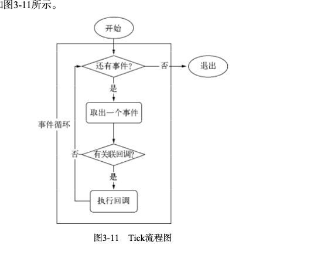
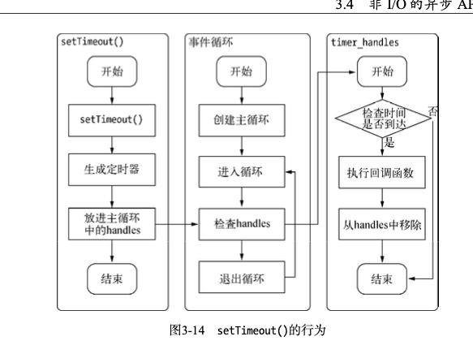

# 一些问题记录

[NodeJS - setTimeout(fn,0) vs setImmediate(fn)](https://stackoverflow.com/questions/24117267/nodejs-settimeoutfn-0-vs-setimmediatefn) setTimeout 0 与 setImmediate 的区别。

[如何解决 nodejs 中 cpu 密集型的任务](https://zhuanlan.zhihu.com/p/220478526)

## 再次看深入浅出 nodejs 的想法

### 模块

在 Node 中引入模块，需要经历以下三个步骤

1. 路径解析
2. 文件定位
3. 编译执行

在 Node 中模块一般分为两种，一个是核心模块比如 `http`, `path`, 一类是用户编写的文件模块。Node 对引入的模块都会进行缓存，以减少二次引入的开销。浏览器仅会
缓存文件，但是 Node 会缓存编译和执行之后的对象。无论是否是核心模块，都会采取缓存优先的策略，只是核心模块缓存检查的优先级高于文件模块的缓存检查。具体可以查看
[module_path](./module_path.js)

### IO

操作系统内核对于 I/O 只有两种方式：`阻塞`与`非阻塞`。

阻塞 I/O 的一个特点是调用之后一定要等到系统内核层面完成所有操作后，调用才结束。
阻塞 I/O 造成 CPU 等待 I/O，浪费等待时间，CPU 的处理能力不能得到充分利用。

> Node 的异步 I/O

事件循环



事件循环是一个典型的`生产者/消费者模型`。异步 I/O、网络请求等则是事件的生产者，源源不断为 Node 提供不同类型的事件，这些事件被传递到对应的观察者那里，事件循环则从观察者那里取出事件并处理。

#### 定时器

`setTimeout()` 和 `setInterval()` 与浏览器中的 API 是一致的，分别用于单次和多次定时执行任务。它们的实现原理与异步 I/O 比较类似，只是不需要 I/O 线程池的参与。调用 `setTimeout()` 或者 `setInterval()` 创建的定时器会被插入到定时器观察者内部的一个`红黑树`中。每次 Tick 执行时，会从该红黑树中迭代取出定时器对象，检查是否超过定时时间，如果超过，就形成一个事件，它的回调函数将立即执行。

定时器



#### process.nextTick()

采用定时器需要动用红黑树，创建定时器对象和迭代等操作，而 `setTimeout(fn, 0)` 的方式较为浪费性能。实际上，process.nextTick() 方法的操作比较轻量，

```js
process.nextTick = function (callback) {
  // on the way out, don't bother.
  // it won't get fired anyway
  if (process._exiting) return
  if (tickDepth >= process.maxTickDepth) maxTickWarn()
  var tock = { callback: callback }
  if (process.domain) tock.domain = process.domain
  nextTickQueue.push(tock)
  if (nextTickQueue.length) {
    process._needTickCallback()
  }
}
```

每次调用 process.nextTick() 方法，只会将回调函数放入队列中，在下一轮 Tick 时取出执行。定时器中采用红黑树的操作时间复杂度为 O(lg(n))，nextTick() 的时间复杂度为 O(1)。相比之下，process.nextTick() 更高效。

### 内存

Buffer 对象不同于其他对象，它不经过 v8 的内存分配机制，所以也不会有堆内存的大小限制。

内存泄露

通常，造成内存泄露的原因有如下几个：

- 缓存
  - 限制缓存尺寸。
  - 高效的自动回收策略, 如果不得不需要使用全局的，提供操作队列的相关接口，以供调用者释放内存。
  - 进程外缓存，在 Node 中主要可以解决一下两个问题
    - 将缓存转移到外部，减少常驻内存的对象的数量，让垃圾回收更高效。
    - 进程之间可以共享缓存。比如 Redis
- 队列消费不及时
  - 采用超时模式：调用加入到队列中就开始计时，超时就直接相应一个超时错误。
  - 采用拒绝模式：当队列拥塞时，新到来的调用会直接响应拥塞错误。
- 作用域未释放

## NodeJs 来一打 c++ 扩展
