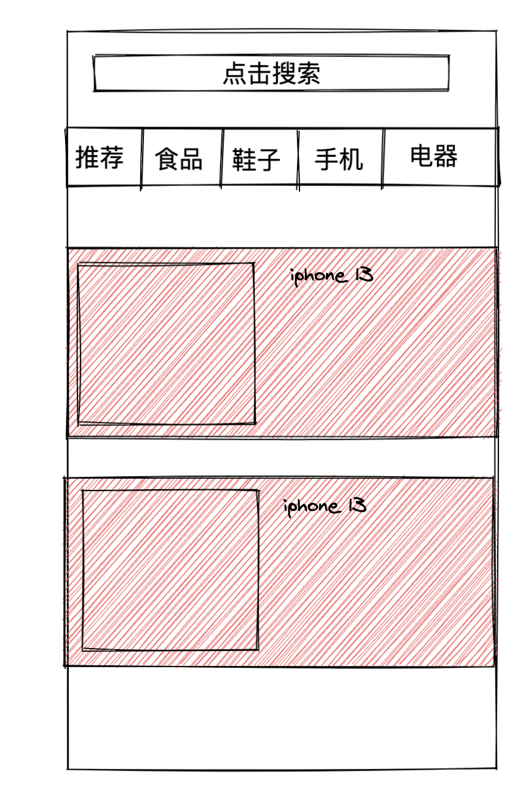
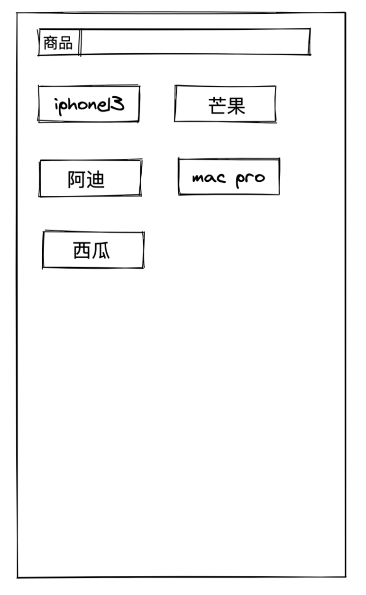

# 如何更好的管理请求依赖

> 本文全部的代码都是以 React 为例子

在业务中会有诸多场景需要多请求的依赖进行管理，比如多 Tab, 筛选或者其他很多的场景都会涉及到请求的依赖。与其说是请求的依赖，不如说是请求的参数，那么如何更好从处理多参数的场景呢？

比如存在这样一个场景


这是一个基础的筛选场景，可以根据顶部的 tab 进行筛选，也可以点击底部的分页器进行分页。

初步分析下，表格中的数据会受到几个因素的影响

- tab 的值会影响表格展示的品类。
- 分页器用来加载更多的数据。

经过分析后，我们可能会写出这样的代码：

```tsx
import * as React from 'react'
// 假设已经封装好了这样的组件
import Filter from './filter'

export function FilterTable() {
  // 目前只有两个依赖 1. page 2. type
  const [request, setRequest] = React.useState({
    page: 1,
    pageSize: 10,
    type: 'apple'
  })
  // 表格的数据源
  const [dataSource, setDataSource] = React.useState([])

  const handleQuery = nextRequest => {
    setRequest(nextRequest)
    query(nextRequest).then(res => {
      setDataSource(nextRequest)
    })
  }

  React.useEffect(() => {
    query(request).then(res => {
      setDataSource(nextRequest)
    })
  }, [])

  return (
    <div>
      <Filter
        dataSource={dataSource}
        curTab={request.type}
        curPage={request.page}
        onChangeTab={nextTab => {
          // 每次切换 tab 的时候 page 重置为 1
          handleQuery({ ...request, type: nextTab, page: 1 })
        }}
        onChangePage={nextPage => {
          handleQuery({ ...request, page: nextPage })
        }}
      />
    </div>
  )
}
```

这样的代码是没有问题的，首先默认进入页面会请求一次接口完成初始化，随后在切换 tab 或者点击分页中也会请求接口。那是否会有更好的写法呢？(这里个人的想法，不代表他人的想法)

首先分析下这段代码，需要请求数据的地方是三处

1. 页面初始化需要请求数据。
2. 切换 tab 需要请求数据。
3. 分页需要请求数据。

因为页面初始化也需要请求数据，因此可以把请求的依赖放在 `useEffect` 中

```tsx
import * as React from 'react'
// 假设已经封装好了这样的组件
import Filter from './filter'

export function FilterTable() {
  // 目前只有两个依赖 1. page 2. type
  const [request, setRequest] = React.useState({
    page: 1,
    pageSize: 10,
    type: 'apple'
  })
  // 表格的数据源
  const [dataSource, setDataSource] = React.useState([])

  const handleQuery = nextRequest => {
    setRequest(nextRequest)
    // query(nextRequest).then(res => {
    //   setDataSource(nextRequest)
    // })
  }

  React.useEffect(() => {
    query(request).then(res => {
      setDataSource(nextRequest)
    })
    // 这里也可以使用 request 作为依赖，因为 request 变化一般都会请求接口。但是这里我们更精确到具体变化的参数
  }, [request.page, request.type])

  return (
    <div>
      <Filter
        dataSource={dataSource}
        curTab={request.type}
        curPage={request.page}
        onChangeTab={nextTab => {
          // 每次切换 tab 的时候 page 重置为 1
          handleQuery({ ...request, type: nextTab, page: 1 })
        }}
        onChangePage={nextPage => {
          handleQuery({ ...request, page: nextPage })
        }}
      />
    </div>
  )
}
```

现在我们把依赖放入到 `useEffect` 中，那么每次 tab 的切换或者是分页的修改只需要修改对应的依赖参数即可就可以实现接口的重新请求。

接口请求，尤其是需要筛选之类的只修改同一个数据源，通常都会涉及到[竞态](https://zh.wikipedia.org/zh-cn/%E7%AB%B6%E7%88%AD%E5%8D%B1%E5%AE%B3)的问题。那么如何处理这种问题？

回到在事件中处理请求的方法，看看如何解决竞态问题。

```tsx
import * as React from 'react'
// 假设已经封装好了这样的组件
import Filter from './filter'
// 使用 lodash 的 isequal
import isEqual from 'lodash.isequal'

export function FilterTable() {
  // 目前只有两个依赖 1. page 2. type
  const [request, setRequest] = React.useState({
    page: 1,
    pageSize: 10,
    type: 'apple'
  })
  // 表格的数据源
  const [dataSource, setDataSource] = React.useState([])
  // 声明一个 ref 用于记录最新的 request 信息
  const requestRef = React.useRef(request)

  const handleQuery = nextRequest => {
    setRequest(nextRequest)
    // 更新 requestRef 保持最新
    requestRef.current = nextRequest
    query(nextRequest).then(res => {
      // 在这里进行比较，如果是相等的则请求接口，否则不请求
      if (isEqual(requestRef.current, request)) {
        setDataSource(nextRequest)
      }
    })
  }

  React.useEffect(() => {
    query(request).then(res => {
      setDataSource(nextRequest)
    })
  }, [])

  return (
    <div>
      <Filter
        dataSource={dataSource}
        curTab={request.type}
        curPage={request.page}
        onChangeTab={nextTab => {
          // 每次切换 tab 的时候 page 重置为 1
          handleQuery({ ...request, type: nextTab, page: 1 })
        }}
        onChangePage={nextPage => {
          handleQuery({ ...request, page: nextPage })
        }}
      />
    </div>
  )
}
```

通过声明一个 `ref` 来记录最新的参数，在事件中通过比较 state 中的 request 和记录最新的 ref 进行比较，如果相同则请求接口，否则不请求。

那么在 `useEffect` 中请求数据又如何处理竞态呢？

```tsx
import * as React from 'react'
// 假设已经封装好了这样的组件
import Filter from './filter'

export function FilterTable() {
  // 目前只有两个依赖 1. page 2. type
  const [request, setRequest] = React.useState({
    page: 1,
    pageSize: 10,
    type: 'apple'
  })
  // 表格的数据源
  const [dataSource, setDataSource] = React.useState([])

  const handleQuery = nextRequest => {
    setRequest(nextRequest)
    // query(nextRequest).then(res => {
    //   setDataSource(nextRequest)
    // })
  }

  React.useEffect(() => {
    // 声明 didCancel
    let didCancel = false
    query(request).then(res => {
      if (!didCancel) {
        setDataSource(nextRequest)
      }
    })
    // 这里也可以使用 request 作为依赖，因为 request 变化一般都会请求接口。但是这里我们更精确到具体变化的参数
    return () => {
      // 每次 effect 重新执行，都会走到这里
      didCancel = true
    }
  }, [request.page, request.type])

  return (
    <div>
      <Filter
        dataSource={dataSource}
        curTab={request.type}
        curPage={request.page}
        onChangeTab={nextTab => {
          // 每次切换 tab 的时候 page 重置为 1
          handleQuery({ ...request, type: nextTab, page: 1 })
        }}
        onChangePage={nextPage => {
          handleQuery({ ...request, page: nextPage })
        }}
      />
    </div>
  )
}
```

在 `useEffect` 中声明一个变量 `didCancel`(你也可以声明任何其他变量) 初始化为 false， 在返回的函数中设置 true，这样每次更新的过程中都会先执行取消函数，可以避免竞态的发生。

那么如果接口初始化不调用，是否放在事件中处理就可以了？

如果接口初始化不需要调用，而是在某个其他的任何事件中调用，是可以采取第一种的方法，但是也可以改造成第二种的方式。因为初始化不需要调用一般初始化都是隐藏的，所以总结下来仍然是属于第二种
的做法，在组件 mount 后加载数据。

那么是否第一种就是不好的，第二种就一定是好的呢？我总结了以下几点关于每种方式的利弊

第一种在事件中处理接口请求:

好处:

1. 可以快速知道点击事件的目的。
2. 接口在点击事件后就会发送请求，时机比较靠前。如果对应的组件很大，渲染很慢，那么此时的优势就会体现出来。

坏处:

1. **接口请求分散在各种，不好管理**，尤其是大量筛选条件的时候。
2. 后续功能发生变更，增加其他的筛选项都需要写一遍事件请求。
3. 竞态不容易处理。

第二种在 `useEffect` 中处理接口请求:

好处:

1. 依赖统一管理，方便快速了解接口会在哪些条件下触发重新请求。可以很好的应对大量筛选条件。
2. 即使后续新增其他的筛选项，只需要新增一个依赖即可，简单快捷。
3. 容易处理竞态

坏处:

1. 接口请求会滞后，尤其是组件很大，渲染很慢的时候，请求的滞后会带来不好的体验。

总结：

当遇到筛选、多 Tab 以及其他各种多条件的情况下，建议在 `useEffect` 中管理依赖，这样可以快速的知道接口会依赖哪些参数的变化而重新请求。尤其是大量的筛选条件下，声明式的管理依赖，方便
后续代码的维护。

> 声明：这是个人看法，当然是否放在事件中还是 effect 中来管理，全凭个人喜好。

## 补充

在 SSR 中，如果使用 `useEffect` 的方式那么在每次渲染的时候都会执行一次，大多数情况下是没有问题的，因为只会多请求一次接口而已。

但是在某些特殊的场景下这个是不行的，比如**推荐场景**，推荐场景可能每次请求接口返回的数据都是不一样的，因为推荐场景在 SSR 渲染的时候，此时的 `useEffect` 不应该被执行。

需要注意的一点是，在 SSR 失败的时候也要兼容 csr 的场景。根据上面的列子，在获取列表的时候我们通常会加载一个 loading, 当数据到达后会取消 loading，比如

```tsx
useEffect(() => {
  // 设置 loading
  setLoading(true)
  // 声明 didCancel
  let didCancel = false
  query(request)
    .then(res => {
      if (!didCancel) {
        setDataSource(nextRequest)
      }
    })
    .finally(() => {
      // 取消 loading
      setLoading(false)
    })
  // 这里也可以使用 request 作为依赖，因为 request 变化一般都会请求接口。但是这里我们更精确到具体变化的参数
  return () => {
    // 每次 effect 重新执行，都会走到这里
    didCancel = true
  }
}, [request.page, request.type])
```

可能在 SSR 框架中会有环境变量来判断是否是在服务端运行，比如 Nextjs 中使用 `process.browser` 来判断是否在服务端运行，但是 `useEffect` 是只在客户端运行的，因此这个环境变量在这里并不会起作用。

现在我们理一理需要处理哪几个问题：

1. 服务端渲染(就是执行 React.hydrated())的时候使得 `useEffect` 的接口不请求。
2. 服务端渲染失败，fallback 到客户端渲染的时候请求接口。
3. update 的时候正常请求接口。
4. 如果有按钮会导致组件 `mount` 或 `unmount`, 那么在 `mount` 的时候也应该请求接口。

举个例子

当带有搜索词进入页面的时候需要展示搜索好的数据，并且携带切换的 Tab



当再次点击上面的搜索框时，会展示最近搜索的词语



因为这两种都同属于一个页面，只是属于不同的组件，假设展示商品的组件叫 `GoodSearchResult`, 展示最近搜索的组件叫 `RecentSearchResult`, 搜索的组件叫 `SearchBox`。那么页面的代码可能是这样的:

```tsx
export function SearchResult() {
  const [mode, setMode] = React.useState('goodsResult')
  return (
    <div>
      <SearchBox
        onSubmit={() => {
          setMode('goodsResult')
        }}
        onClick={() => {
          setMode('recentSearch')
        }}
      />
      {mode === 'goodsResult' ? <GoodSearchResult /> : <RecentSearchResult />}
    </div>
  )
}
```

`GoodSearchResult` 组件是依赖 tab 以及分页进行请求接口

```tsx
function GoodSearchResult() {
  useEffect(() => {
    setLoading(true)
    queryData().finally(() => {
      setLoading(false)
    })
  }, [page, tab])
}
```

此时这个场景可以命中提到的四个问题：

1. 服务端渲染(就是执行 React.hydrated())的时候使得 `useEffect` 的接口不请求。
   ❌ 如果初始化就展示了 `GoodSearchResult` 组件，但是在服务端进行了渲染，因此这里的接口会在服务端请求一次。在客户端我们希望不再请求。
2. 服务端渲染失败，fallback 到客户端渲染的时候请求接口。
   ✅ 如果服务端请求失败，fallback 到客户端，在我们的请求代码是在 `useEffect` 中写的，因此这里不会存在问题。
3. update 的时候正常请求接口。
   ✅ 此时点击 tab 或者分页都会重新执行 effect 因此也没有问题。
4. 如果有按钮会导致组件 `mount` 或 `unmount`, 那么在 `mount` 的时候也应该请求接口。
   ✅ 点击搜索或卸载 `GoodSearchResult` 组件，触发搜后会再次 mount `GoodSearchResult` 组件，这里也不存在问题。

那如何解决第一个问题，一步一步的，尝试第一种方法

### 方法一: 在 mount 的时候不执行这里的 effect

```tsx
function GoodSearchResult() {
  const mountedRef = React.useRef(false)

  useEffect(() => {
    mountedRef.current = true
  }, [])

  useEffect(() => {
    // mount 后再执行
    if (mountedRef.current) {
      setLoading(true)
      queryData().finally(() => {
        setLoading(false)
      })
    }
  }, [page, tab])
}
```

这个可以解决问题 1， 但是会引起问题 2 和问题 4。因此这个方法目前不可行。

针对此时的问题 4，我们可以再次引入一个变量，就是在调用 `SearchBox` 组件的 onSubmit 的时候修改变量的值，从而来解决问题 4, 修改 Page 的组件

```tsx
export function SearchResult() {
  const [mode, setMode] = React.useState('goodsResult')
  const [isClickSearch, setIsClickSearch] = React.useState(false)
  return (
    <div>
      <SearchBox
        onSubmit={() => {
          setMode('goodsResult')
          setIsClickSearch(true)
        }}
        onClick={() => {
          setMode('recentSearch')
        }}
      />
      {mode === 'goodsResult' ? (
        <GoodSearchResult isClickSearch={isClickSearch} />
      ) : (
        <RecentSearchResult />
      )}
    </div>
  )
}
```

修改 `GoodSearchResult` 组件，加上 `isClickSearch` 变量

```tsx
function GoodSearchResult({ isClickSearch }: any) {
  const mountedRef = React.useRef(false)

  useEffect(() => {
    mountedRef.current = true
  }, [])

  useEffect(() => {
    // mount 后再执行或者触发过搜索也会执行
    if (mountedRef.current || isClickSearch) {
      setLoading(true)
      queryData().finally(() => {
        setLoading(false)
      })
    }
  }, [page, tab])
}
```

因为增加了 `isClickSearch` 变量，因此这个问题 4 就解决了，但是问题 2 还没有解决。当然了问题 2 是可以通过各自服务端框架的内部来解决的。比如在服务端请求的接口，当 fallback 到 csr 时，会再请调用一次接口
那么此时问题 2 也会被解决。举个例子：

```tsx
export const fetchServer = async () => {}
```

你使用的服务端框架会在 SSR 的时候调用 `fetchServer` 来获取数据，如果服务端某种情况下失败了，那么在客户端仍然会再次调用 `fetchServer` 从而实现 fallback 也没有问题。在我们的例子中，此时的 `fetchServer`
是会调用接口获取推荐的数据。因此问题 2 在某种程度是可以在 SSR 框架内部解决的。

回顾下第一种办法使用了两个变量 `mountedRef` 和 `isClickSearch` 来处理这个问题，同时依靠 SSR 框架来解决问题 2。虽然问题解决了，但是每次遇到这样的问题都要这样处理吗？这样处理会不会很烦？

### 方法二: 维护一个全局的变量

目前我们的代码，只有问题 1 不满足，默认情况下其他情况都满足的，那我们是否就针对问题给出一个好的解决方案呢？

```tsx
function GoodSearchResult() {
  useEffect(() => {
    setLoading(true)
    queryData().finally(() => {
      setLoading(false)
    })
  }, [page, tab])
}
```

针对问题 1，其实我们只需要知道在执行 `React.hydrated()` 的时候不执行 `useEffect` 中请求函数即可。那么是否知道执行了 `React.hydrated()` 呢？其实是可以的，假设服务端的代码是这样的

```tsx
...etc
ReactDOM.hydrate(<App />, document.getElementId('root'))
```

此时可以在 App 的外层在包一个 `Wrapper` 组件, 同时声明一个变量来记录是否 `hydrate` 的过程

```tsx
function Wrapper({ children }) {
  useEffect(() => {
    window.hasHydrated = true
  }, [])
  return <>{children}</>
}

React.hydrate(
  <Wrapper>
    <App />
  </Wrapper>,
  document.getElementId('root')
)
```

当运行到 App 组件的时候，App 的子组件内部获取到的 `window.hasHydrated` 都为 false, 当 `hydrate` 执行完毕后，`window.hasHydrated` 为 true。因此也就知道了是否是在 `hydrate`。

修改一下 `GoodSearchResult` 组件

```tsx
function GoodSearchResult() {
  useEffect(() => {
    // 注意这里的判断
    if (window.hasHyDrated) {
      setLoading(true)
      queryData().finally(() => {
        setLoading(false)
      })
    }
  }, [page, tab])
}
```

只需要增加一行 `if (window.hasHYDrated)` 即可，问题 1 解决了。问题 3,4 也都不是问题，因为在 `hydrate` 后，下次再执行 `window.hasHYDrated` 已经是 true 了。那么问题 2 呢？如果服务端渲染失败，会 fallback 到客户端，此时
`window.hasHYDrated` 为 false, 是不是就有问题了？继续修改服务端的代码

```tsx
// 在这里完全可以知道是否服务端是否有问题，有问题就执行 ReactDOM.render 否则执行 ReactDOM.hydrated
// 这个 ctx 可以获取到服务端的上下文
const ctx = useCtx()
if (ctx.useSSR) {
  ReactDOM.hydrate(<App />, document.getElementId('root'))
} else {
  window.hasHyDrated = true
  ReactDOM.render(<App />, document.getElementId('root'))
}
```

根据服务端是可以知道是否成功还是失败的，如果失败 fallback 到客户端后，那么就提前设置 `window.hasHyDrated` 的值，此问题也得到解决。

## 总结

当遇到 SSR 的时候，可以通过额外的一个变量来解决这个问题，通过判断是否是 `hydrated` 来实现是否跳过第一次的执行过程。
